# Benchmarks

A comparison of Volucer, RoadRunner, FrankenPHP, and nginx with PHP-FPM using a shared benchmark harness. Results include throughput, latency, and process-tree memory.

All values come from committed benchmark results in
[`volucer-competition`](https://github.com/sailantis/volucer-competition). Tables and
charts are generated from the same measurements. Missing successful measurements are
shown as `-`, not as zero. The repository includes the method, raw rows, and controls.

Measurements were interleaved on the same host using the same harness and PHP build.
Each chart identifies its host, method, and measured software versions.

## C1 — Echo — `GET /echo`

Measurements were interleaved across server arms, sizing numbers, and load levels on the same host. The order rotated between rounds to reduce ordering effects. **PHP procs** is how many PHP processes serve requests, and it provides a resource-use context for each result.

With `spawn_cgi` and `children`, multiple PHP processes serve through one slot. The sizing column makes this configuration comparable with other arms that use one process per slot.

One row's number is not a process count: FrankenPHP runs a single OS process, so its value is how many worker *threads* that process starts. The row names its own unit. The two are compared because both are what the host pays for.

Each chart shows request rate in requests per second, with bars that start at zero for direct visual comparison.

The label on each bar is its throughput factor relative to the fastest server in that chart. The dashed line marks that reference. For example, `x2.5` means the server handled about 1/2.5 of the reference's requests per second. The reference can differ between charts.

The range shows the minimum and maximum of the round-paired throughput ratios, converted back to requests per second. Pairing measurements from the same round helps account for host variation during the run; the range describes the comparison rather than either server alone.

If a factor range includes 1.0, the measured range includes equal throughput. The table marks that result **tie** to distinguish it from a comparison whose observed range stays above or below 1.0.

### OPcache on

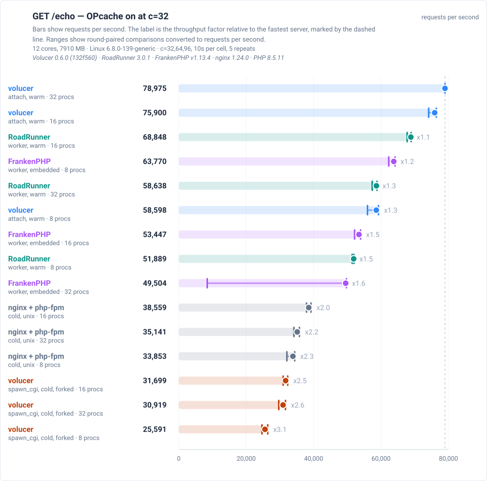
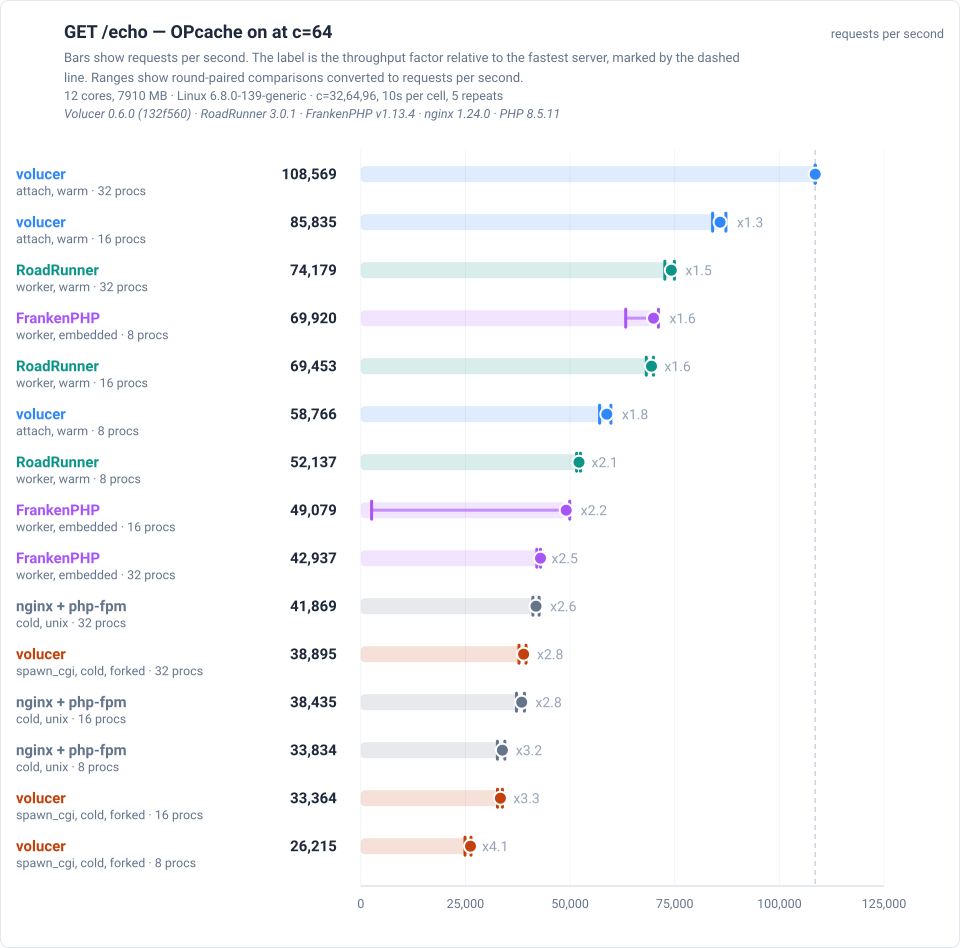
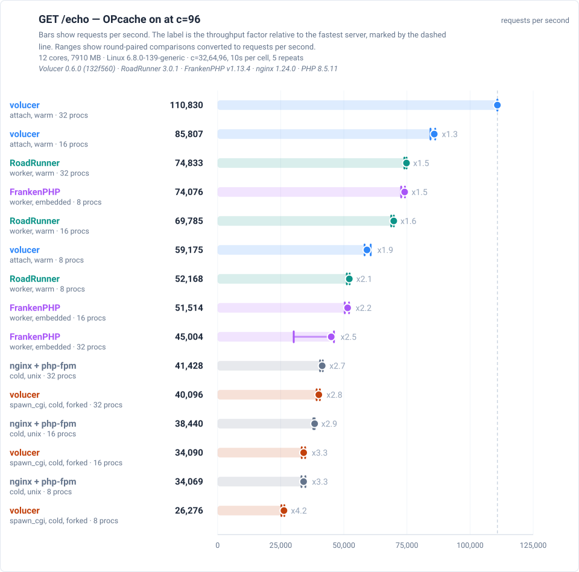

The **factor** compares each row with the fastest server in the table (`x1.0`). A factor of `x2.5` means about 40% of the reference throughput. The range shows the round-paired comparison; **tie** marks a range that includes 1.0.

| server | model | PHP procs | rps | p50 | p99 | factor (range) |
|---|---|---:|---:|---:|---:|---:|
| volucer | attach (warm, unix relay) | 32 | **110,830** | 0.82 ms | 2.02 ms | x1.0 |
| volucer | attach (warm, unix relay) | 16 | **85,807** | 1.08 ms | 3.25 ms | x1.3 (1.29–1.31) |
| RoadRunner | worker (warm, pipe) | 32 | **74,833** | 1.14 ms | 3.61 ms | x1.5 (1.48–1.50) |
| FrankenPHP | worker (warm, embedded) | 8 threads | **74,076** | 1.15 ms | 4.25 ms | x1.5 (1.49–1.52) |
| RoadRunner | worker (warm, pipe) | 16 | **69,785** | 1.28 ms | 2.73 ms | x1.6 (1.59–1.61) |
| volucer | attach (warm, unix relay) | 8 | **59,175** | 1.62 ms | 6.2 ms | x1.9 (1.83–1.90) |
| RoadRunner | worker (warm, pipe) | 8 | **52,168** | 1.76 ms | 3.02 ms | x2.1 (2.12–2.17) |
| FrankenPHP | worker (warm, embedded) | 16 threads | **51,514** | 1.75 ms | 5.33 ms | x2.2 (2.13–2.20) |
| FrankenPHP | worker (warm, embedded) | 32 threads | **45,004** | 1.9 ms | 5.85 ms | x2.5 (2.40–3.68) |
| nginx + php-fpm | cold, unix socket | 32 | **41,428** | 2.22 ms | 4.13 ms | x2.7 (2.66–2.73) |
| volucer | spawn_cgi (cold, unix, children) | 32 | **40,096** | 2.32 ms | 4.86 ms | x2.8 (2.74–2.83) |
| nginx + php-fpm | cold, unix socket | 16 | **38,440** | 2.46 ms | 3.25 ms | x2.9 (2.88–2.92) |
| volucer | spawn_cgi (cold, unix, children) | 16 | **34,090** | 2.79 ms | 7.22 ms | x3.3 (3.20–3.33) |
| nginx + php-fpm | cold, unix socket | 8 | **34,069** | 2.79 ms | 3.51 ms | x3.3 (3.19–3.33) |
| volucer | spawn_cgi (cold, unix, children) | 8 | **26,276** | 3.61 ms | 10.95 ms | x4.2 (4.20–4.38) |

This table compares the two cold PHP process pools at equal process counts: `spawn_cgi` with `children` and nginx with php-fpm.

| PHP procs | server | model | rps | spawn_cgi ÷ php-fpm |
|---:|---|---|---:|---:|
| 8 | volucer | spawn_cgi (cold, unix, children) | **26,276** | x0.77 |
| 8 | nginx + php-fpm | cold, unix socket | **34,069** | — |
| 16 | volucer | spawn_cgi (cold, unix, children) | **34,090** | x0.89 |
| 16 | nginx + php-fpm | cold, unix socket | **38,440** | — |
| 32 | volucer | spawn_cgi (cold, unix, children) | **40,096** | x0.97 |
| 32 | nginx + php-fpm | cold, unix socket | **41,428** | — |

The factor is `spawn_cgi` throughput divided by php-fpm throughput at the same process count. Values above 1.0 indicate higher measured throughput for `spawn_cgi`; values below 1.0 indicate higher throughput for php-fpm.

This table compares each arm across each step between consecutive published sizing numbers, so an arm that peaks in the middle is visible as a step of its own. Ratios are paired by measurement round. A ratio above 1.0 indicates higher throughput at the larger number, and below 1.0 higher throughput at the smaller one; a range including 1.0 means the measured rounds also include equal throughput.

| server | model | step (PHP procs) | rps at smaller | rps at larger | larger/smaller (range) |
|---|---|---|---:|---:|---:|
| volucer | attach (warm, unix relay) | 8 → 16 | 59,175 | 85,807 | x1.45 (1.39–1.48) |
| volucer | attach (warm, unix relay) | 16 → 32 | 85,807 | 110,830 | x1.29 (1.29–1.31) |
| RoadRunner | worker (warm, pipe) | 8 → 16 | 52,168 | 69,785 | x1.34 (1.32–1.35) |
| RoadRunner | worker (warm, pipe) | 16 → 32 | 69,785 | 74,833 | x1.07 (1.07–1.08) |
| FrankenPHP | worker (warm, embedded) | 8 → 16 threads | 74,076 | 51,514 | x0.70 (0.69–0.70) |
| FrankenPHP | worker (warm, embedded) | 16 → 32 threads | 51,514 | 45,004 | x0.87 (0.86–0.90) |
| volucer | spawn_cgi (cold, unix, children) | 8 → 16 | 26,276 | 34,090 | x1.30 (1.27–1.32) |
| volucer | spawn_cgi (cold, unix, children) | 16 → 32 | 34,090 | 40,096 | x1.18 (1.15–1.20) |
| nginx + php-fpm | cold, unix socket | 8 → 16 | 34,069 | 38,440 | x1.13 (1.11–1.15) |
| nginx + php-fpm | cold, unix socket | 16 → 32 | 38,440 | 41,428 | x1.08 (1.07–1.09) |

## What it costs in memory

Memory is measured after the run across the full process tree. The table reports **proportional set size (PSS)** in MiB. PSS apportions each shared memory page among the processes that use it, making it useful for comparing deployments with different process models.

RSS is shown in parentheses for reference. Summed across processes, RSS counts shared pages once for every process that maps them, while PSS divides their contribution among those processes.

| server | model | 8 procs | 16 procs | 32 procs |
|---|---|---:|---:|---:|
| volucer | attach (warm, unix relay) | 68.8 (280) | 82.0 (487) | 100.2 (878) |
| RoadRunner | worker (warm, pipe) | 252.8 (505) | 420.5 (950) | 749.6 (1,837) |
| FrankenPHP | worker (warm, embedded), threads | 131.8 (132) | 146.4 (146) | 170.0 (170) |
| volucer | spawn_cgi (cold, unix, children) | 65.5 (301) | 73.3 (523) | 93.2 (973) |
| nginx + php-fpm | cold, unix socket | 54.8 (312) | 63.6 (543) | 80.5 (1,003) |

Each value is PSS in MiB; RSS in MiB is shown in parentheses.

### The same PHP processes, arranged two ways

This comparison holds the number of serving PHP processes constant: one process per slot versus multiple forked children behind a slot.

| shape | PHP processes | median PSS (MiB) | min | max | vs one per slot |
|---|---:|---:|---:|---:|---:|
| 8 separate slots | 8 | **193.8** | 193.6 | 194.6 | — |
| 1 slot × 8 children | 8 | **65.5** | 64.7 | 66.2 | 3.0× less |
| 16 separate slots | 16 | **340.3** | 339.9 | 340.9 | — |
| 1 slot × 16 children | 16 | **73.3** | 72.8 | 73.8 | 4.6× less |
| 32 separate slots | 32 | **633.7** | 633.0 | 634.3 | — |
| 1 slot × 32 children | 32 | **93.2** | 92.5 | 94.2 | 6.8× less |

The **vs one per slot** value is the separate-slot median divided by the forked-pool median at the same process count. For example, `4.5× less` means the forked pool's median PSS is about one quarter of the separate-slot median.

Forked children can share memory pages inherited from their master. PSS accounts for this sharing, which is why the forked-pool and separate-slot arrangements can have different total PSS at the same number of serving processes.

## C6 — API Items — `GET /api/items-fast`

Measurements were interleaved across server arms, sizing numbers, and load levels on the same host. The order rotated between rounds to reduce ordering effects. **PHP procs** is how many PHP processes serve requests, and it provides a resource-use context for each result.

With `spawn_cgi` and `children`, multiple PHP processes serve through one slot. The sizing column makes this configuration comparable with other arms that use one process per slot.

One row's number is not a process count: FrankenPHP runs a single OS process, so its value is how many worker *threads* that process starts. The row names its own unit. The two are compared because both are what the host pays for.

Each chart shows request rate in requests per second, with bars that start at zero for direct visual comparison.

The label on each bar is its throughput factor relative to the fastest server in that chart. The dashed line marks that reference. For example, `x2.5` means the server handled about 1/2.5 of the reference's requests per second. The reference can differ between charts.

The range shows the minimum and maximum of the round-paired throughput ratios, converted back to requests per second. Pairing measurements from the same round helps account for host variation during the run; the range describes the comparison rather than either server alone.

If a factor range includes 1.0, the measured range includes equal throughput. The table marks that result **tie** to distinguish it from a comparison whose observed range stays above or below 1.0.

### OPcache on

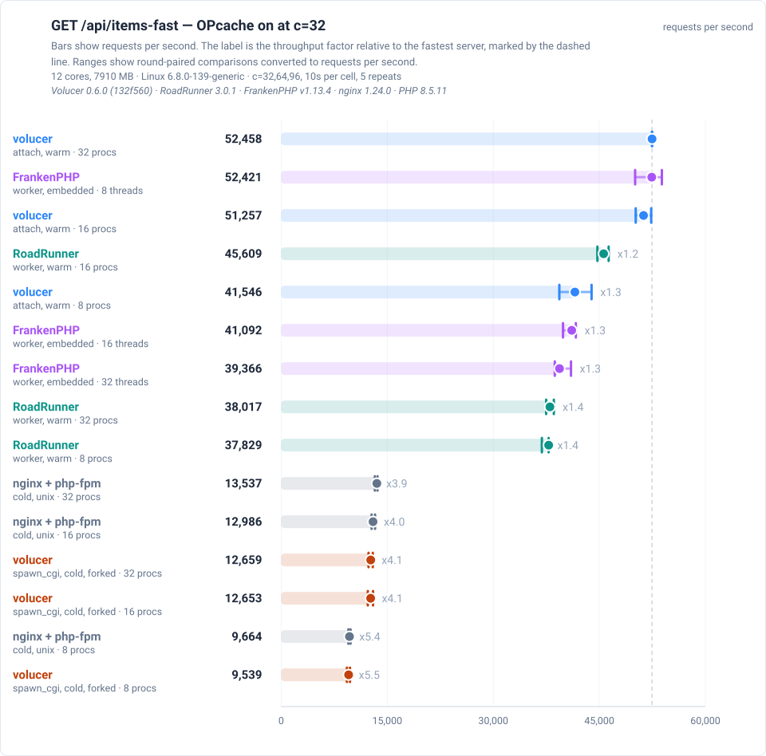
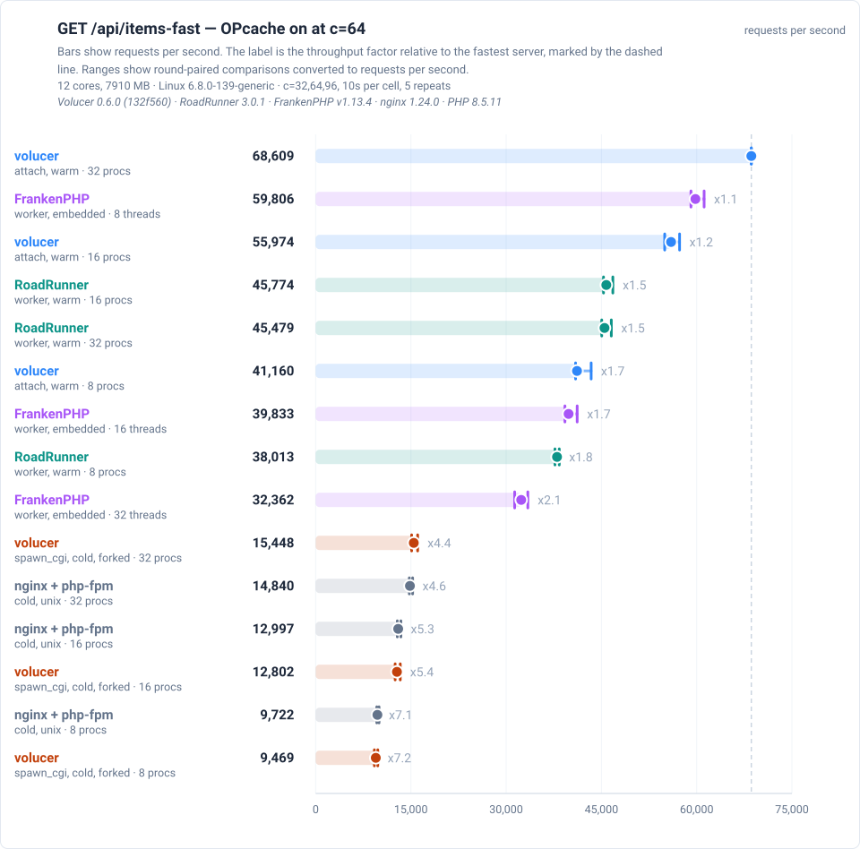
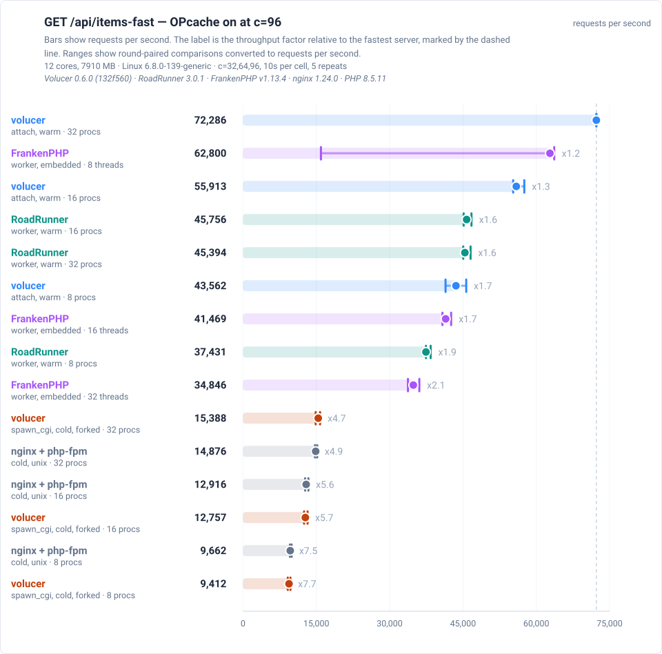

The **factor** compares each row with the fastest server in the table (`x1.0`). A factor of `x2.5` means about 40% of the reference throughput. The range shows the round-paired comparison; **tie** marks a range that includes 1.0.

| server | model | PHP procs | rps | p50 | p99 | factor (range) |
|---|---|---:|---:|---:|---:|---:|
| volucer | attach (warm, unix relay) | 32 | **72,286** | 1.25 ms | 3.14 ms | x1.0 |
| FrankenPHP | worker (warm, embedded) | 8 threads | **62,800** | 1.34 ms | 4.74 ms | x1.2 (1.14–4.54) |
| volucer | attach (warm, unix relay) | 16 | **55,913** | 1.68 ms | 4.8 ms | x1.3 (1.26–1.31) |
| RoadRunner | worker (warm, pipe) | 16 | **45,756** | 1.99 ms | 3.72 ms | x1.6 (1.55–1.60) |
| RoadRunner | worker (warm, pipe) | 32 | **45,394** | 1.97 ms | 4.68 ms | x1.6 (1.55–1.60) |
| volucer | attach (warm, unix relay) | 8 | **43,562** | 2.22 ms | 8.04 ms | x1.7 (1.58–1.74) |
| FrankenPHP | worker (warm, embedded) | 16 threads | **41,469** | 2.2 ms | 6.42 ms | x1.7 (1.70–1.77) |
| RoadRunner | worker (warm, pipe) | 8 | **37,431** | 2.47 ms | 3.94 ms | x1.9 (1.88–1.93) |
| FrankenPHP | worker (warm, embedded) | 32 threads | **34,846** | 2.5 ms | 7.24 ms | x2.1 (2.00–2.14) |
| volucer | spawn_cgi (cold, unix, children) | 32 | **15,388** | 6.15 ms | 12.31 ms | x4.7 (4.59–4.86) |
| nginx + php-fpm | cold, unix socket | 32 | **14,876** | 6.31 ms | 8.89 ms | x4.9 (4.77–4.91) |
| nginx + php-fpm | cold, unix socket | 16 | **12,916** | 7.33 ms | 9.26 ms | x5.6 (5.40–5.69) |
| volucer | spawn_cgi (cold, unix, children) | 16 | **12,757** | 7.46 ms | 19.6 ms | x5.7 (5.47–5.78) |
| nginx + php-fpm | cold, unix socket | 8 | **9,662** | 9.88 ms | 11.68 ms | x7.5 (7.27–7.54) |
| volucer | spawn_cgi (cold, unix, children) | 8 | **9,412** | 10.11 ms | 28.52 ms | x7.7 (7.45–7.90) |

This table compares the two cold PHP process pools at equal process counts: `spawn_cgi` with `children` and nginx with php-fpm.

| PHP procs | server | model | rps | spawn_cgi ÷ php-fpm |
|---:|---|---|---:|---:|
| 8 | volucer | spawn_cgi (cold, unix, children) | **9,412** | x0.97 |
| 8 | nginx + php-fpm | cold, unix socket | **9,662** | — |
| 16 | volucer | spawn_cgi (cold, unix, children) | **12,757** | x0.99 |
| 16 | nginx + php-fpm | cold, unix socket | **12,916** | — |
| 32 | volucer | spawn_cgi (cold, unix, children) | **15,388** | x1.03 |
| 32 | nginx + php-fpm | cold, unix socket | **14,876** | — |

The factor is `spawn_cgi` throughput divided by php-fpm throughput at the same process count. Values above 1.0 indicate higher measured throughput for `spawn_cgi`; values below 1.0 indicate higher throughput for php-fpm.

This table compares each arm across each step between consecutive published sizing numbers, so an arm that peaks in the middle is visible as a step of its own. Ratios are paired by measurement round. A ratio above 1.0 indicates higher throughput at the larger number, and below 1.0 higher throughput at the smaller one; a range including 1.0 means the measured rounds also include equal throughput.

| server | model | step (PHP procs) | rps at smaller | rps at larger | larger/smaller (range) |
|---|---|---|---:|---:|---:|
| volucer | attach (warm, unix relay) | 8 → 16 | 43,562 | 55,913 | x1.28 (1.26–1.34) |
| volucer | attach (warm, unix relay) | 16 → 32 | 55,913 | 72,286 | x1.29 (1.26–1.31) |
| RoadRunner | worker (warm, pipe) | 8 → 16 | 37,431 | 45,756 | x1.22 (1.19–1.24) |
| RoadRunner | worker (warm, pipe) | 16 → 32 | 45,756 | 45,394 | x0.99 (0.98–1.00) — tie |
| FrankenPHP | worker (warm, embedded) | 8 → 16 threads | 62,800 | 41,469 | x0.66 (0.65–2.67) — tie |
| FrankenPHP | worker (warm, embedded) | 16 → 32 threads | 41,469 | 34,846 | x0.84 (0.83–0.85) |
| volucer | spawn_cgi (cold, unix, children) | 8 → 16 | 9,412 | 12,757 | x1.36 (1.34–1.39) |
| volucer | spawn_cgi (cold, unix, children) | 16 → 32 | 12,757 | 15,388 | x1.21 (1.19–1.22) |
| nginx + php-fpm | cold, unix socket | 8 → 16 | 9,662 | 12,916 | x1.34 (1.32–1.36) |
| nginx + php-fpm | cold, unix socket | 16 → 32 | 12,916 | 14,876 | x1.15 (1.13–1.17) |

## What it costs in memory

Memory is measured after the run across the full process tree. The table reports **proportional set size (PSS)** in MiB. PSS apportions each shared memory page among the processes that use it, making it useful for comparing deployments with different process models.

RSS is shown in parentheses for reference. Summed across processes, RSS counts shared pages once for every process that maps them, while PSS divides their contribution among those processes.

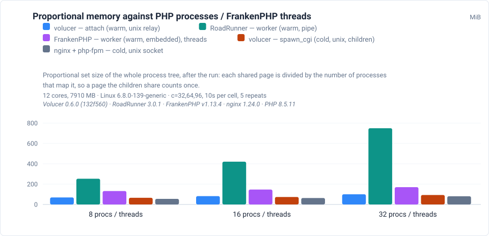

| server | model | 8 procs | 16 procs | 32 procs |
|---|---|---:|---:|---:|
| volucer | attach (warm, unix relay) | 68.8 (280) | 82.0 (487) | 100.2 (878) |
| RoadRunner | worker (warm, pipe) | 252.8 (505) | 420.5 (950) | 749.6 (1,837) |
| FrankenPHP | worker (warm, embedded), threads | 131.8 (132) | 146.4 (146) | 170.0 (170) |
| volucer | spawn_cgi (cold, unix, children) | 65.5 (301) | 73.3 (523) | 93.2 (973) |
| nginx + php-fpm | cold, unix socket | 54.8 (312) | 63.6 (543) | 80.5 (1,003) |

Each value is PSS in MiB; RSS in MiB is shown in parentheses.

### The same PHP processes, arranged two ways

This comparison holds the number of serving PHP processes constant: one process per slot versus multiple forked children behind a slot.

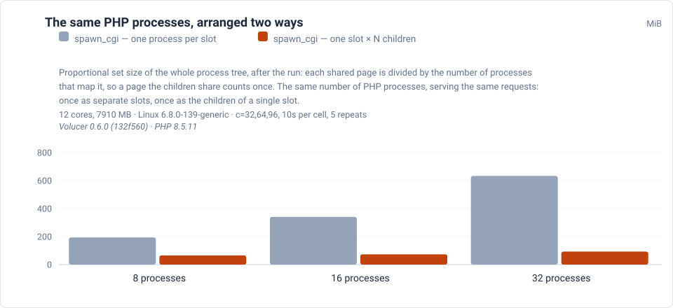

| shape | PHP processes | median PSS (MiB) | min | max | vs one per slot |
|---|---:|---:|---:|---:|---:|
| 8 separate slots | 8 | **193.8** | 193.6 | 194.6 | — |
| 1 slot × 8 children | 8 | **65.5** | 64.7 | 66.2 | 3.0× less |
| 16 separate slots | 16 | **340.3** | 339.9 | 340.9 | — |
| 1 slot × 16 children | 16 | **73.3** | 72.8 | 73.8 | 4.6× less |
| 32 separate slots | 32 | **633.7** | 633.0 | 634.3 | — |
| 1 slot × 32 children | 32 | **93.2** | 92.5 | 94.2 | 6.8× less |

The **vs one per slot** value is the separate-slot median divided by the forked-pool median at the same process count. For example, `4.5× less` means the forked pool's median PSS is about one quarter of the separate-slot median.

Forked children can share memory pages inherited from their master. PSS accounts for this sharing, which is why the forked-pool and separate-slot arrangements can have different total PSS at the same number of serving processes.

## C5 — HTML Items — `GET /items-fast`

Measurements were interleaved across server arms, sizing numbers, and load levels on the same host. The order rotated between rounds to reduce ordering effects. **PHP procs** is how many PHP processes serve requests, and it provides a resource-use context for each result.

With `spawn_cgi` and `children`, multiple PHP processes serve through one slot. The sizing column makes this configuration comparable with other arms that use one process per slot.

One row's number is not a process count: FrankenPHP runs a single OS process, so its value is how many worker *threads* that process starts. The row names its own unit. The two are compared because both are what the host pays for.

Each chart shows request rate in requests per second, with bars that start at zero for direct visual comparison.

The label on each bar is its throughput factor relative to the fastest server in that chart. The dashed line marks that reference. For example, `x2.5` means the server handled about 1/2.5 of the reference's requests per second. The reference can differ between charts.

The range shows the minimum and maximum of the round-paired throughput ratios, converted back to requests per second. Pairing measurements from the same round helps account for host variation during the run; the range describes the comparison rather than either server alone.

If a factor range includes 1.0, the measured range includes equal throughput. The table marks that result **tie** to distinguish it from a comparison whose observed range stays above or below 1.0.

### OPcache on

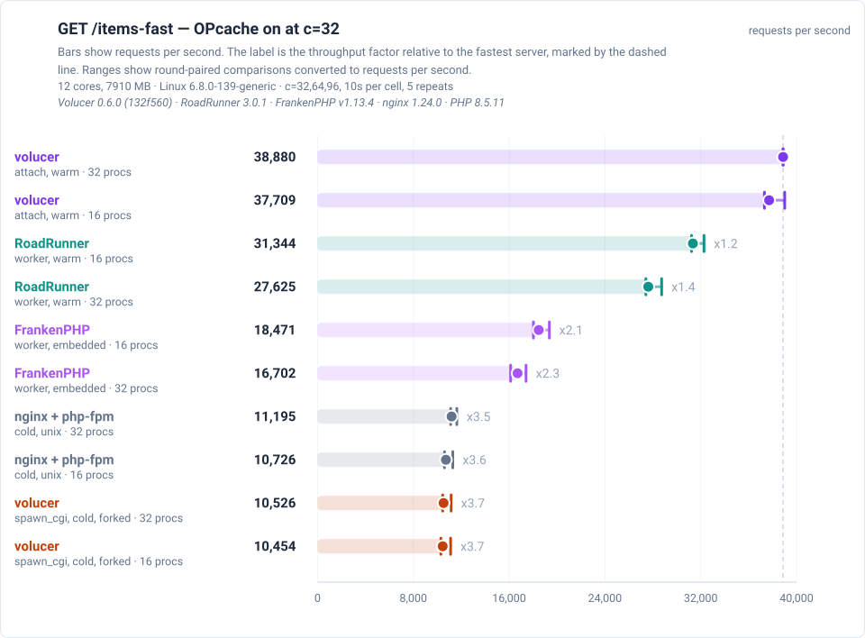
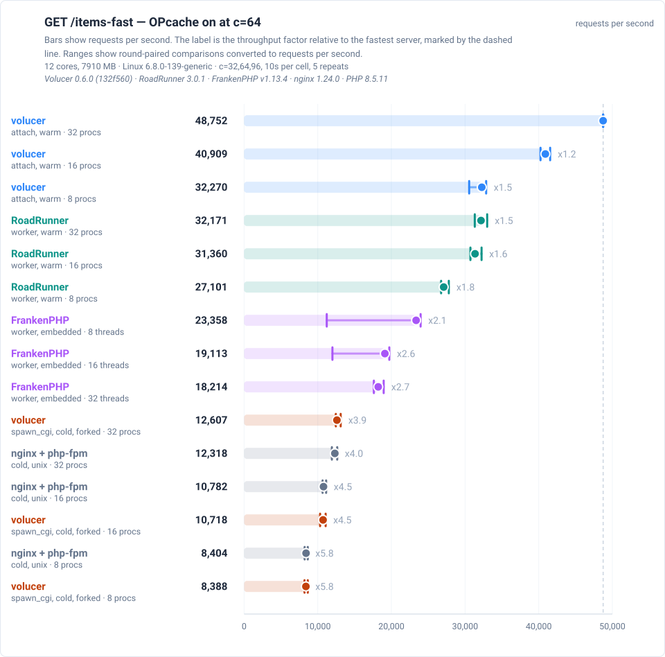
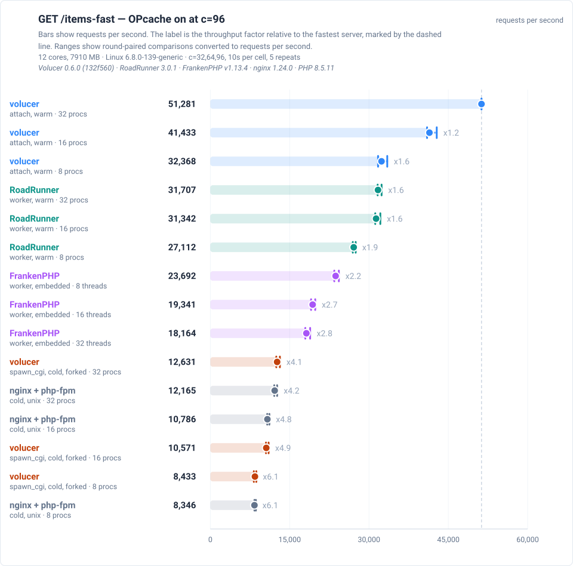

The **factor** compares each row with the fastest server in the table (`x1.0`). A factor of `x2.5` means about 40% of the reference throughput. The range shows the round-paired comparison; **tie** marks a range that includes 1.0.

| server | model | PHP procs | rps | p50 | p99 | factor (range) |
|---|---|---:|---:|---:|---:|---:|
| volucer | attach (warm, unix relay) | 32 | **51,281** | 1.79 ms | 4.16 ms | x1.0 |
| volucer | attach (warm, unix relay) | 16 | **41,433** | 2.28 ms | 6.24 ms | x1.2 (1.20–1.25) |
| volucer | attach (warm, unix relay) | 8 | **32,368** | 2.97 ms | 10.47 ms | x1.6 (1.53–1.62) |
| RoadRunner | worker (warm, pipe) | 32 | **31,707** | 2.85 ms | 6.45 ms | x1.6 (1.58–1.62) |
| RoadRunner | worker (warm, pipe) | 16 | **31,342** | 2.92 ms | 5.08 ms | x1.6 (1.60–1.64) |
| RoadRunner | worker (warm, pipe) | 8 | **27,112** | 3.44 ms | 5.05 ms | x1.9 (1.87–1.90) |
| FrankenPHP | worker (warm, embedded) | 8 threads | **23,692** | 3.88 ms | 6.22 ms | x2.2 (2.11–2.19) |
| FrankenPHP | worker (warm, embedded) | 16 threads | **19,341** | 4.72 ms | 8.56 ms | x2.7 (2.59–2.69) |
| FrankenPHP | worker (warm, embedded) | 32 threads | **18,164** | 4.85 ms | 13.14 ms | x2.8 (2.72–2.86) |
| volucer | spawn_cgi (cold, unix, children) | 32 | **12,631** | 7.49 ms | 14.8 ms | x4.1 (3.90–4.11) |
| nginx + php-fpm | cold, unix socket | 32 | **12,165** | 7.72 ms | 10.71 ms | x4.2 (4.06–4.24) |
| nginx + php-fpm | cold, unix socket | 16 | **10,786** | 8.82 ms | 10.8 ms | x4.8 (4.59–4.77) |
| volucer | spawn_cgi (cold, unix, children) | 16 | **10,571** | 8.98 ms | 23.65 ms | x4.9 (4.65–4.88) |
| volucer | spawn_cgi (cold, unix, children) | 8 | **8,433** | 11.34 ms | 31.88 ms | x6.1 (5.90–6.24) |
| nginx + php-fpm | cold, unix socket | 8 | **8,346** | 11.41 ms | 13.26 ms | x6.1 (5.96–6.15) |

This table compares the two cold PHP process pools at equal process counts: `spawn_cgi` with `children` and nginx with php-fpm.

| PHP procs | server | model | rps | spawn_cgi ÷ php-fpm |
|---:|---|---|---:|---:|
| 8 | volucer | spawn_cgi (cold, unix, children) | **8,433** | x1.01 |
| 8 | nginx + php-fpm | cold, unix socket | **8,346** | — |
| 16 | volucer | spawn_cgi (cold, unix, children) | **10,571** | x0.98 |
| 16 | nginx + php-fpm | cold, unix socket | **10,786** | — |
| 32 | volucer | spawn_cgi (cold, unix, children) | **12,631** | x1.04 |
| 32 | nginx + php-fpm | cold, unix socket | **12,165** | — |

The factor is `spawn_cgi` throughput divided by php-fpm throughput at the same process count. Values above 1.0 indicate higher measured throughput for `spawn_cgi`; values below 1.0 indicate higher throughput for php-fpm.

This table compares each arm across each step between consecutive published sizing numbers, so an arm that peaks in the middle is visible as a step of its own. Ratios are paired by measurement round. A ratio above 1.0 indicates higher throughput at the larger number, and below 1.0 higher throughput at the smaller one; a range including 1.0 means the measured rounds also include equal throughput.

| server | model | step (PHP procs) | rps at smaller | rps at larger | larger/smaller (range) |
|---|---|---|---:|---:|---:|
| volucer | attach (warm, unix relay) | 8 → 16 | 32,368 | 41,433 | x1.28 (1.23–1.30) |
| volucer | attach (warm, unix relay) | 16 → 32 | 41,433 | 51,281 | x1.24 (1.20–1.25) |
| RoadRunner | worker (warm, pipe) | 8 → 16 | 27,112 | 31,342 | x1.16 (1.14–1.18) |
| RoadRunner | worker (warm, pipe) | 16 → 32 | 31,342 | 31,707 | x1.01 (1.01–1.03) |
| FrankenPHP | worker (warm, embedded) | 8 → 16 threads | 23,692 | 19,341 | x0.82 (0.81–0.82) |
| FrankenPHP | worker (warm, embedded) | 16 → 32 threads | 19,341 | 18,164 | x0.94 (0.92–0.95) |
| volucer | spawn_cgi (cold, unix, children) | 8 → 16 | 8,433 | 10,571 | x1.25 (1.25–1.28) |
| volucer | spawn_cgi (cold, unix, children) | 16 → 32 | 10,571 | 12,631 | x1.19 (1.17–1.20) |
| nginx + php-fpm | cold, unix socket | 8 → 16 | 8,346 | 10,786 | x1.29 (1.28–1.31) |
| nginx + php-fpm | cold, unix socket | 16 → 32 | 10,786 | 12,165 | x1.13 (1.11–1.14) |

## What it costs in memory

Memory is measured after the run across the full process tree. The table reports **proportional set size (PSS)** in MiB. PSS apportions each shared memory page among the processes that use it, making it useful for comparing deployments with different process models.

RSS is shown in parentheses for reference. Summed across processes, RSS counts shared pages once for every process that maps them, while PSS divides their contribution among those processes.

| server | model | 8 procs | 16 procs | 32 procs |
|---|---|---:|---:|---:|
| volucer | attach (warm, unix relay) | 68.8 (280) | 82.0 (487) | 100.2 (878) |
| RoadRunner | worker (warm, pipe) | 252.8 (505) | 420.5 (950) | 749.6 (1,837) |
| FrankenPHP | worker (warm, embedded), threads | 131.8 (132) | 146.4 (146) | 170.0 (170) |
| volucer | spawn_cgi (cold, unix, children) | 65.5 (301) | 73.3 (523) | 93.2 (973) |
| nginx + php-fpm | cold, unix socket | 54.8 (312) | 63.6 (543) | 80.5 (1,003) |

Each value is PSS in MiB; RSS in MiB is shown in parentheses.

### The same PHP processes, arranged two ways

This comparison holds the number of serving PHP processes constant: one process per slot versus multiple forked children behind a slot.

| shape | PHP processes | median PSS (MiB) | min | max | vs one per slot |
|---|---:|---:|---:|---:|---:|
| 8 separate slots | 8 | **193.8** | 193.6 | 194.6 | — |
| 1 slot × 8 children | 8 | **65.5** | 64.7 | 66.2 | 3.0× less |
| 16 separate slots | 16 | **340.3** | 339.9 | 340.9 | — |
| 1 slot × 16 children | 16 | **73.3** | 72.8 | 73.8 | 4.6× less |
| 32 separate slots | 32 | **633.7** | 633.0 | 634.3 | — |
| 1 slot × 32 children | 32 | **93.2** | 92.5 | 94.2 | 6.8× less |

The **vs one per slot** value is the separate-slot median divided by the forked-pool median at the same process count. For example, `4.5× less` means the forked pool's median PSS is about one quarter of the separate-slot median.

Forked children can share memory pages inherited from their master. PSS accounts for this sharing, which is why the forked-pool and separate-slot arrangements can have different total PSS at the same number of serving processes.

## What was measured

These are the software versions recorded for this benchmark run. Results may differ with other versions or builds. The values come from the run metadata and raw measurements in [`volucer-competition`](https://github.com/sailantis/volucer-competition).

| what | version |
|---|---|
| PHP (CLI) | PHP 8.5.11 (cli) |
| PHP (CGI) | PHP 8.5.11 (cgi-fcgi) |
| PHP (FPM) | PHP 8.5.11 (fpm-fcgi) |
| Volucer | volucer 0.6.0 |
| Volucer commit | 132f560 |
| RoadRunner | 3.0.1 |
| FrankenPHP | v1.13.4 |
| nginx | nginx/1.24.0 (Ubuntu) (worker_processes 4) |
| Bench app commit | cb21f89 |

Each chart also identifies the host, measurement method, and software versions, so it can be understood independently of this page.
